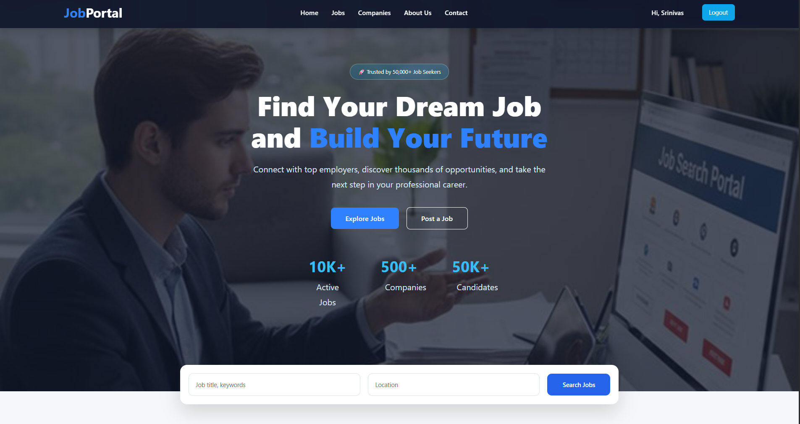
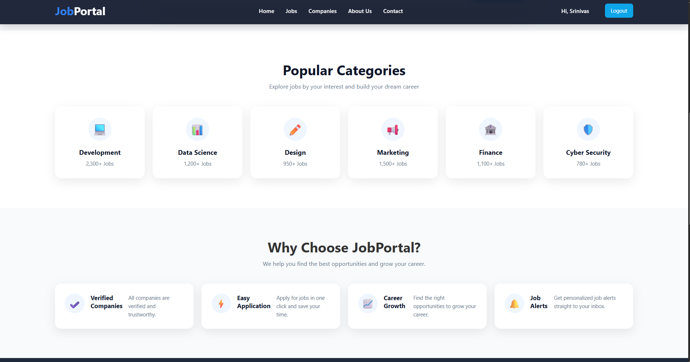
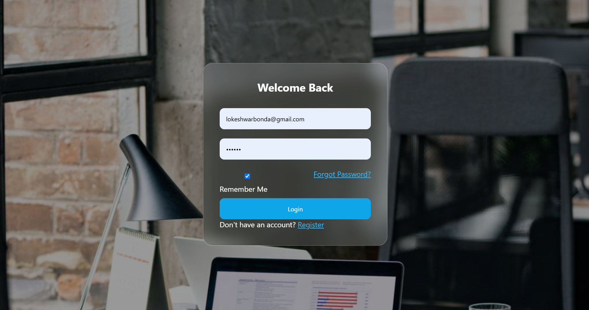
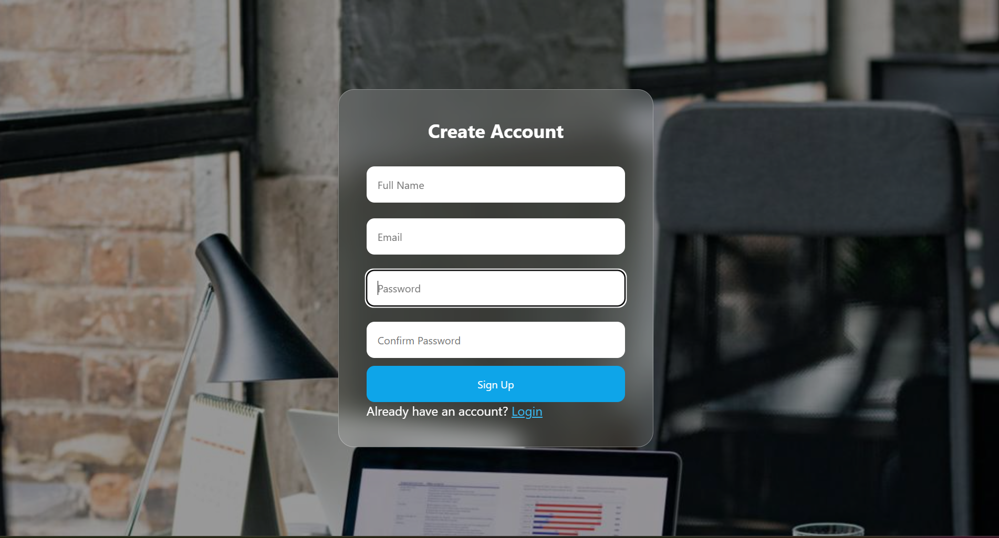
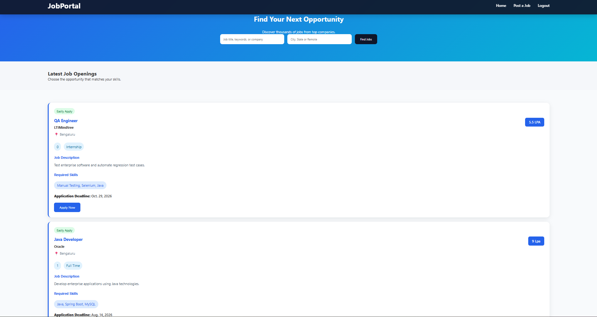

# Job Portal

This is a simple job portal website built using Django.

The project allows employers to post jobs and candidates to browse and apply for them. It was developed as a learning project to improve my full-stack web development skills.

## Features

- User Registration and Login
- Employer Dashboard
- Candidate Dashboard
- Post Jobs
- Browse Jobs
- Responsive Design

## Technologies Used

- Python
- Django
- HTML
- CSS
- JavaScript
- PostgreSQL

## Screenshots

### Home Page






### Login Page



### Signup Page



### Jobs Page


### Post Job


### Explore Jobs




Run the server

```bash
python manage.py runserver
```

Open

```
http://127.0.0.1:8000/
```

## Author

B Lokeshwar
